# Despliegue y puesta a punto de VM en la plataforma TECS de ZTE
- [Despliegue y puesta a punto de VM en la plataforma TECS de ZTE](#despliegue-y-puesta-a-punto-de-vm-en-la-plataforma-tecs-de-zte)
  - [Despliegue de la VM](#despliegue-de-la-vm)
  - [Características de la VM](#características-de-la-vm)
  - [Puesta a punto de la VM](#puesta-a-punto-de-la-vm)
    - [Cambiar nombre de interfaz](#cambiar-nombre-de-interfaz)
    - [Agregar nombres de Dominio](#agregar-nombres-de-dominio)
    - [Hacer las rutas e direcciones IPs Persistentes](#hacer-las-rutas-e-direcciones-ips-persistentes)
    - [Configurar el acceso SSH basado Clave Público/Privada](#configurar-el-acceso-ssh-basado-clave-públicoprivada)

## Despliegue de la VM

1. Crear la red

    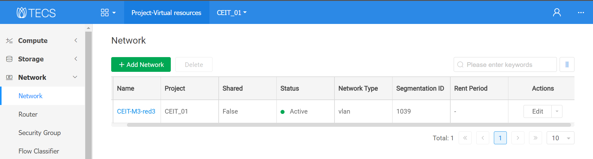

    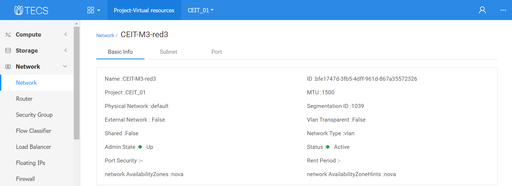

2. Crear la sub-red

    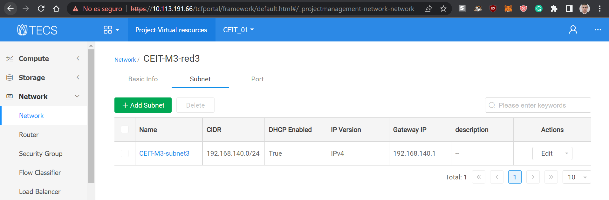

    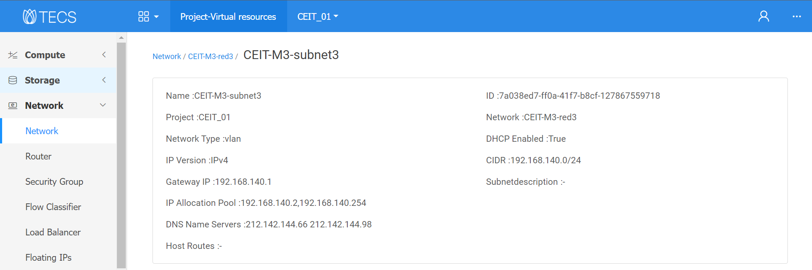

3. Crear el flavor

    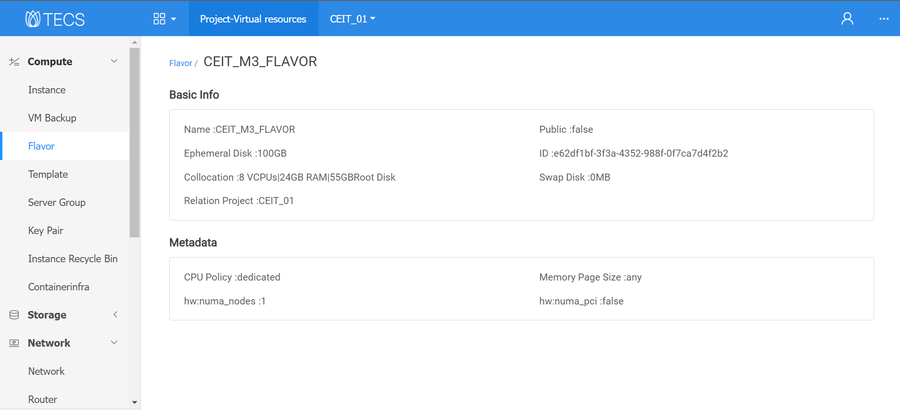

4. Subir la VM

    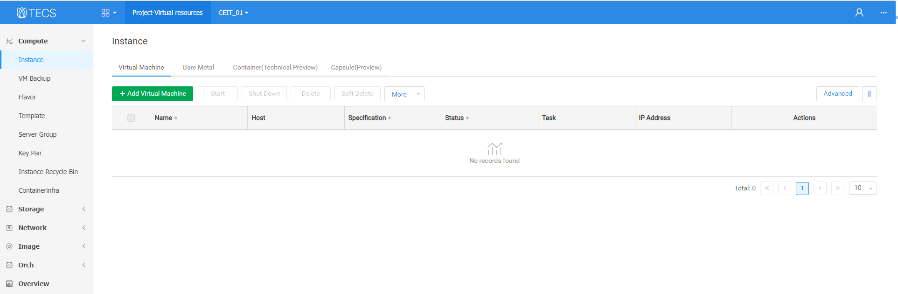

    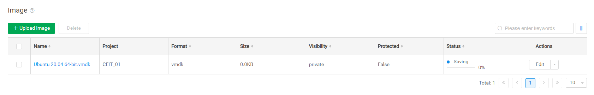

    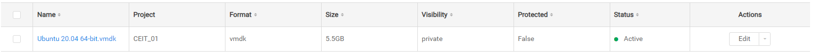

5. Iniciar la VM

    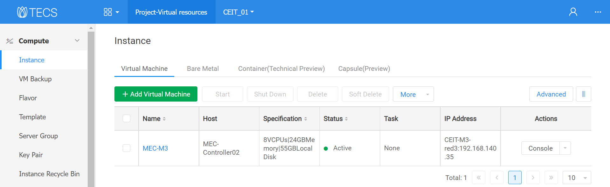

## Características de la VM

- La máquina que se ha subido es un `Ubuntu 20.04 Server` de 64 bit.
- Para crear la VM en formato VMDK se descargó un .iso desde la página ofical de Ubuntu y montado en el hypervisor VMware.
- Además de las respectivas actualizaciones se aprovisionó la VM con la herramienta *resolvconf* para garantizar que los DNSs queden fiajdos una vez instados.

## Puesta a punto de la VM

### Cambiar nombre de interfaz

1. Copiar la *dirección MAC* ejecutando `ip addr`.
2. Modificar la *dirección MAC* en netplan:

    ```console
    sudo nano /etc/netplan/00-installer-config.yaml
    ```

    - Así debe quedar *netplan*:

    ```console
    # This is the network config written by 'subiquity'
    network:
      ethernets:
        ens4:
          dhcp4: false
          match:
            macaddress: fa:16:3e:5a:c4:0d
          set-name: eth0
      version: 2
    ```

    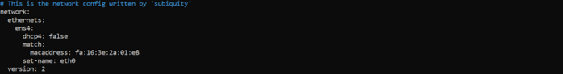

3. Aplicar los cambios sobre *netplan*:

    ```console
    sudo netplan try
    sudo netplan apply
    ```

4. Verificar (y modificar en caso que sea necesario) que la configuración el *puerto* de la *sub-red* coincida con la configuración realizada en el *punto 2* de esta sub-sección.

    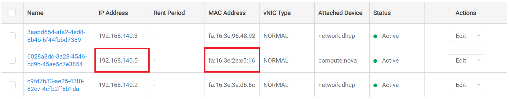

### Agregar nombres de Dominio

1. Agregar los DNSs

    ```console
    sudo nano /etc/resolvconf/resolv.conf.d/head
    ```

    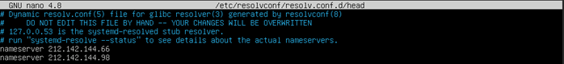

2. Aplicar los cambios

    ```console
    sudo resolvconf -u
    ```

3. Verificar el estado:

    ```console
    systemd-resolve –status
    ```

4. Verificar los cambios:

    ```console
    sudo shutdown -r now
    more /etc/resolv.conf
    ```

### Hacer las rutas e direcciones IPs Persistentes

1. Crear un script

    ```console
    sudo nano /usr/local/sbin/my-startup.sh
    ```

   1. Agregar la siguiente información

    ```console
    #!/bin/sh
    sudo ifconfig eth0 212.142.131.117 netmask 255.255.255.255
    sudo ip addr add 192.168.253.191 dev eth0
    sudo route add -net 192.168.253.0/24 dev eth0
    sudo route add default gw 192.168.253.1 eth0
    ```

2. Otorgar permisos de ejecusión al script creado:

    ```console
    sudo chmod +x /usr/local/sbin/my-startup.sh
    ```

3. Crear un servicio asociado al script.

    ```console
    sudo nano /etc/systemd/system/my-startup.service
    ```

   1. Agregar la siguiente información

    ```console
    [Unit]
    Description=My Startup
    [Service]
    ExecStart=/usr/local/sbin/my-startup.sh
    [Install]
    WantedBy=multi-user.target
    ```

4. Habilitar el servicio

    ```console
    sudo systemctl enable my-startup.service
    ```

5. Verificar el estado del servicio

    ```console
    sudo systemctl status my-startup.service
    ```

### Configurar el acceso SSH basado Clave Público/Privada

1. En una máquina externa a la VM que se está aprovisionando en el MEC de ZTE se genera un par de claves:

    ```console
    ssh-keygen -t rsa
    ```

   1. Completar los siguiente pasos:

        ```console
        a. At the following prompt, accept the default or enter the file path where you want to save the key pair  and press Enter.
        Generating public/private dsa key pair.
        Enter the file in which to save the key (home/root/.ssh/id_rsa):
    
        b. At the following prompt, accept the default or enter the passphrase and press Enter.
        Enter the passphrase (empty for no passphrase): passphrase
    
        c. At the following prompt, confirm your passphrase selection and press Enter.
        Enter the same passphrase again: passphrase
        This example is a sample of the system response:
        Your identification was saved in /home/root/.ssh/id_rsa.
        Your public key was saved in /home/root/.ssh/id_rsa.pub. 
        The key fingerprint is this value:
        2c:3f:a4:be:46:23:47:19:f7:dc:74:9b:69:24:4a:44 root@ps701
        ```

2. Verificar el par de claves:

    ```console
    cd $HOME/.ssh
    ```

    - Output:

    ```console
    cat id_rsa
    cat id_rsa.pub
    ```

3. Enviar la clave pública a la VM del MEC de ZTE. Por ejemplo, vía *scp* donde `212.142.131.117` se corresponde a la IP Pública asignada por ZTE:

    ```console
    scp id_rsa.pub ubuntu@212.142.131.117:/home/ubuntu/.ssh
    ```

4. Agregar la clve pública dentro de las claves autorizadas

   - Verificar el archivo *autorized_key*:

    ```console
    more ~/.ssh/authorized_keys
    ```

    > **Nota:** Si no exite el archivo `autorized_key` puede ser manualmente creado.

   - Copiar la IP públca importada en el archivo `autorized_key`.

    ```console
    cat ~/.ssh/id_rsa.pub >> authorized_keys
    ```

   - Verificar nuevamente el archivo *autorized_key*:

    ```console
    more ~/.ssh/authorized_keys
    ```

5. Configurar el *servidor SSH*, descomentando o agregando los siguientes puntos:

    ```console
    RSAAuthentication yes
    PubkeyAuthentication yes
    AuthorizedKeysFile .ssh/authorized_keys
    PermitRootLogin prohibit-password
    PermitRootLogin no
    UsePAM no
    PasswordAuthentication no
    ```

6. Reiniciar el servicio SSH:

    ```console
    sudo systemctl restart ssh
    sudo systemctl restart sshd.service
    ```
